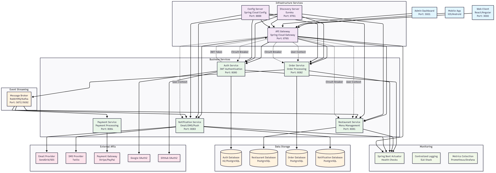

# ByteBites Microservices Architecture Documentation

## 🏗️ System Overview

ByteBites is a cloud-native microservices platform designed for an online food delivery startup. The architecture follows modern distributed system patterns with emphasis on scalability, security, and resilience.

## 🏗️ Architecture Overview

ByteBites follows a microservices architecture pattern with the following components:


## 🎯 Design Principles

### 1. **Microservices Architecture**
- **Single Responsibility**: Each service handles one business domain
- **Loose Coupling**: Services communicate via well-defined APIs
- **High Cohesion**: Related functionalities are grouped together
- **Independent Deployment**: Services can be deployed independently

### 2. **Cloud-Native Patterns**
- **Service Discovery**: Dynamic service location via Eureka
- **Configuration Management**: Externalized configuration via Config Server
- **API Gateway Pattern**: Single entry point for client requests
- **Circuit Breaker**: Fault tolerance and resilience

### 3. **Security-First Design**
- **JWT-Based Authentication**: Stateless token-based security
- **Role-Based Access Control**: Granular permission management
- **OAuth2 Integration**: Social login capabilities
- **API Gateway Security**: Centralized security enforcement

---

## 🏢 Architecture Layers

### **1. Client Layer**
```
Web Client (React/Angular) ← → Mobile App (iOS/Android) ← → Admin Dashboard
```

**Purpose**: User interfaces that consume the API services
- **Web Client**: Customer-facing web application for browsing and ordering
- **Mobile App**: Native mobile applications for customers
- **Admin Dashboard**: Administrative interface for system management

### **2. Infrastructure Layer**
```
API Gateway ← → Discovery Server ← → Config Server
```

**Purpose**: Cross-cutting infrastructure services

#### **API Gateway (Port: 8765)**
- **Role**: Single entry point, request routing, authentication
- **Responsibilities**:
  - Route requests to appropriate microservices
  - JWT token validation and user context extraction
  - CORS handling and request/response transformation
  - Rate limiting and request throttling
  - Load balancing across service instances

#### **Discovery Server (Port: 8761)**
- **Role**: Service registry and discovery
- **Responsibilities**:
  - Service registration and health monitoring
  - Dynamic service location for load balancing
  - Service availability tracking
  - Enable zero-downtime deployments

#### **Config Server (Port: 8888)**
- **Role**: Centralized configuration management
- **Responsibilities**:
  - Environment-specific configuration delivery
  - Configuration versioning and rollback
  - Encrypted sensitive configuration storage
  - Dynamic configuration refresh

### **3. Business Services Layer**
```
Auth Service ← → Restaurant Service ← → Order Service ← → Notification Service ← → Payment Service
```

**Purpose**: Core business logic implementation

#### **Auth Service (Port: 8080)**
- **Domain**: User authentication and authorization
- **Responsibilities**:
  - User registration and profile management
  - JWT token generation and validation
  - Password hashing and verification (BCrypt)
  - OAuth2 integration (Google, GitHub)
  - Role-based access control (CUSTOMER, RESTAURANT_OWNER, ADMIN)

#### **Restaurant Service (Port: 8081)**
- **Domain**: Restaurant and menu management
- **Responsibilities**:
  - Restaurant profile management
  - Menu creation and updates
  - Restaurant search and filtering
  - Restaurant owner operations
  - Business hours and availability management

#### **Order Service (Port: 8082)**
- **Domain**: Order processing and management
- **Responsibilities**:
  - Order placement and validation
  - Order status tracking (PENDING, CONFIRMED, PREPARING, DELIVERED)
  - Order history and retrieval
  - Integration with restaurant and payment services
  - Order cancellation and refund processing

#### **Notification Service (Port: 8083)**
- **Domain**: Multi-channel notification delivery
- **Responsibilities**:
  - Email notifications (order confirmations, updates)
  - SMS notifications (delivery updates)
  - Push notifications (mobile apps)
  - Notification templates and personalization
  - Delivery status tracking

#### **Payment Service (Port: 8084)**
- **Domain**: Payment processing and financial transactions
- **Responsibilities**:
  - Payment method management
  - Transaction processing
  - Refund and chargeback handling
  - Payment gateway integration (Stripe, PayPal)
  - Financial reporting and reconciliation

### **4. Data Layer**
```
Auth DB ← → Restaurant DB ← → Order DB ← → Notification DB
```

**Purpose**: Data persistence and storage

- **Database Per Service**: Each service owns its data
- **Data Isolation**: No direct database access between services
- **Technology Flexibility**: Different databases for different needs
- **ACID Compliance**: Transactional integrity within service boundaries

### **5. Event Streaming Layer**
```
Message Broker (RabbitMQ/Kafka)
```

**Purpose**: Asynchronous communication and event-driven architecture

- **Event Publishing**: Services publish domain events
- **Event Consumption**: Services react to relevant events
- **Decoupling**: Reduce direct service dependencies
- **Scalability**: Handle high-throughput async processing

---

## 🔄 Communication Patterns

### **1. Synchronous Communication**
- **Client ↔ API Gateway**: HTTP/HTTPS REST APIs
- **Gateway ↔ Services**: Load-balanced HTTP calls via service discovery
- **Service ↔ External APIs**: HTTP integration with third-party services

### **2. Asynchronous Communication**
- **Event-Driven**: Services publish/subscribe to business events
- **Message Queues**: Reliable message delivery for critical operations
- **Event Sourcing**: Capture all state changes as events

### **3. Data Communication**
- **Service ↔ Database**: Direct database connections (one DB per service)
- **Configuration**: Services pull configuration from Config Server
- **Service Registration**: Services register with Discovery Server

---

## 🔐 Security Architecture

### **Authentication Flow**
```
1. User Login → Auth Service validates credentials
2. Auth Service generates JWT token with user claims
3. Client stores JWT token securely
4. Client includes JWT in Authorization header
5. API Gateway validates JWT and extracts user context
6. Gateway forwards request with user context headers
7. Business services use user context for authorization
```

### **Authorization Levels**
- **Public Endpoints**: No authentication required (login, register)
- **Authenticated Endpoints**: Valid JWT token required
- **Role-Based Endpoints**: Specific roles required (admin operations)
- **Resource-Based**: Users can only access their own resources

### **Security Features**
- **Password Security**: BCrypt hashing with salt
- **Token Security**: Signed JWT tokens with expiration
- **Transport Security**: HTTPS/TLS encryption
- **API Security**: Rate limiting and request validation

---

## 📊 Event-Driven Architecture

### **Key Events**
```
OrderPlacedEvent → Triggers notification and restaurant preparation
PaymentProcessedEvent → Updates order status and inventory
UserRegisteredEvent → Triggers welcome email and setup
RestaurantUpdatedEvent → Invalidates caches and notifications
```

### **Event Flow Example: Order Processing**
1. **Customer places order** → `OrderPlacedEvent`
2. **Order Service** publishes event to message broker
3. **Notification Service** consumes event → sends confirmation email
4. **Restaurant Service** consumes event → notifies restaurant owner
5. **Payment Service** processes payment → `PaymentProcessedEvent`
6. **Order Service** updates status → `OrderStatusChangedEvent`

---

## 🛡️ Resilience Patterns

### **Circuit Breaker**
- **Purpose**: Prevent cascade failures
- **Implementation**: Resilience4j library
- **States**: CLOSED, OPEN, HALF_OPEN
- **Configuration**: Failure threshold, timeout, retry attempts

### **Bulkhead**
- **Purpose**: Isolate critical resources
- **Implementation**: Separate thread pools for different operations
- **Benefits**: One slow operation doesn't block others

### **Timeout & Retry**
- **Purpose**: Handle temporary failures
- **Configuration**: Exponential backoff with jitter
- **Fallback**: Graceful degradation when services unavailable

### **Health Checks**
- **Purpose**: Monitor service health
- **Implementation**: Spring Boot Actuator
- **Integration**: Discovery Server for routing decisions

---

## 📈 Scalability Considerations

### **Horizontal Scaling**
- **Service Instances**: Multiple instances per service
- **Load Balancing**: Gateway distributes requests across instances
- **Database Scaling**: Read replicas and sharding strategies

### **Performance Optimization**
- **Caching**: Redis for frequently accessed data
- **Database Optimization**: Connection pooling and query optimization
- **Async Processing**: Non-blocking operations where possible

### **Monitoring & Observability**
- **Distributed Tracing**: Track requests across services
- **Metrics Collection**: Prometheus for metrics aggregation
- **Centralized Logging**: ELK stack for log analysis
- **Health Dashboards**: Real-time system health monitoring

---

## 🚀 Deployment Architecture

### **Container Strategy**
- **Docker**: Each service in its own container
- **Kubernetes**: Orchestration and scaling
- **Service Mesh**: Istio for advanced traffic management

### **Environment Strategy**
- **Development**: Local with H2 databases
- **Staging**: Cloud with PostgreSQL
- **Production**: Multi-region with high availability

### **CI/CD Pipeline**
- **Build**: Maven for compilation and testing
- **Test**: Unit, integration, and contract testing
- **Deploy**: Blue-green deployment for zero downtime
- **Monitor**: Continuous health and performance monitoring

---

## 📋 Technology Stack Summary

| Layer | Technology | Purpose |
|-------|------------|---------|
| **Frontend** | React/Angular, React Native | User interfaces |
| **API Gateway** | Spring Cloud Gateway | Request routing and security |
| **Services** | Spring Boot, Spring Cloud | Microservices framework |
| **Security** | Spring Security, JWT | Authentication and authorization |
| **Discovery** | Netflix Eureka | Service registration and discovery |
| **Configuration** | Spring Cloud Config | Centralized configuration |
| **Database** | PostgreSQL, H2 | Data persistence |
| **Messaging** | RabbitMQ/Apache Kafka | Event-driven communication |
| **Monitoring** | Spring Actuator, Prometheus | Health and metrics |
| **Resilience** | Resilience4j | Circuit breakers and fault tolerance |
| **Build** | Maven | Dependency management and build |
| **Container** | Docker, Kubernetes | Containerization and orchestration |

---

## 🎯 Benefits of This Architecture

### **Scalability**
- Independent scaling of services based on demand
- Horizontal scaling with load balancing
- Database scaling per service requirements

### **Resilience**
- Fault isolation between services
- Circuit breakers prevent cascade failures
- Graceful degradation capabilities

### **Maintainability**
- Clear service boundaries and responsibilities
- Independent development and deployment
- Technology diversity per service needs

### **Security**
- Centralized authentication and authorization
- Service-to-service security
- Secure configuration management

### **Developer Productivity**
- Team ownership of specific services
- Independent development cycles
- Clear API contracts between services

This architecture provides a solid foundation for a scalable, secure, and maintainable food delivery platform that can grow with business requirements.